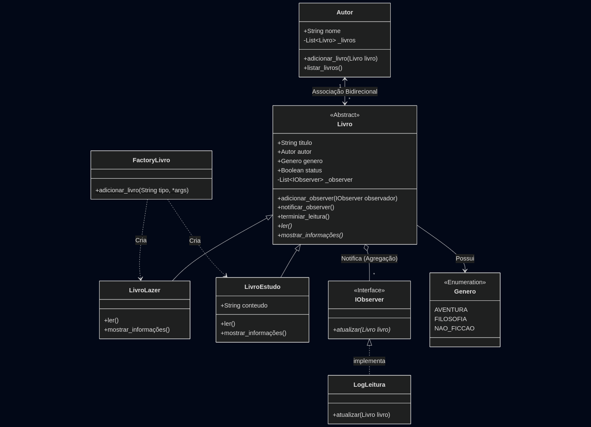

# Sistema de Gerenciamento de Leitura

## Descrição e Objetivo
Este projeto consiste em um sistema em 
Python desenvolvido para simular o gerenciamento de uma biblioteca pessoal e o acompanhamento de leituras.

O objetivo principal é demonstrar a aplicação prática e avançada dos quatro pilares da Programação Orientada a Objetos (POO) e a implementação de Padrões de Projeto (Design Patterns) para resolver problemas de criação de objetos e monitoramento de eventos.

O sistema permite:
* Cadastrar Autores e vincular suas obras automaticamente.
* Criar diferentes tipos de livros (Lazer e Estudo) de forma dinâmica.
* Monitorar o status de leitura.
* Gerar logs automáticos (arquivo `.txt`) sempre que uma leitura é concluída.

---

## Diagrama de Classes




---

## Estrutura das Classes e Pilares da POO

O projeto foi arquitetado respeitando rigorosamente os conceitos de Orientação a Objetos:

### 1. Abstração
Utilizada na classe base **`Livro`** (em `models/Livro.py`).
* A classe herda de `ABC` (Abstract Base Class).
* Define métodos abstratos como `ler()` e `mostrar_informações()`, obrigando as classes filhas a implementarem seus próprios comportamentos.
* **No código:** Uso de `@abstractmethod`.

### 2. Encapsulamento
Proteção dos dados internos das classes para evitar estados inconsistentes.
* **`Autor`**: O nome do autor é formatado automaticamente através de *setters*.
* **`Livro`**: O título também possui formatação controlada via propriedades (`@property`).
* Os atributos como `_livros` e `_observer` são protegidos, sendo manipulados apenas por métodos específicos (`adicionar_livro`, `adicionar_observer`).

### 3. Herança
Reaproveitamento de código e especialização.
* **`LivroEstudo`** e **`LivroLazer`** herdam de `Livro`. Elas aproveitam a lógica de vínculo com o Autor e a lista de observadores, mas adicionam características específicas (como o atributo `conteudo` em livros de estudo).

### 4. Polimorfismo
Métodos com a mesma assinatura comportando-se de formas diferentes.
* O método **`mostrar_informações()`** exibe dados diferentes dependendo se o objeto é um livro de Lazer ou de Estudo.
* O método **`ler()`** executa a mudança de status e o disparo de notificações, comportando-se adequadamente para cada tipo.

---

## Padrões de Projeto Aplicados

### 1. Factory Method (Fábrica)
**Onde:** `models/FactoryLivro.py`

Utilizado para centralizar e desacoplar a criação dos objetos. O cliente (arquivo principal) não precisa saber qual classe específica (`LivroLazer` ou `LivroEstudo`) instanciar; ele apenas informa o "tipo" desejado.

* **Implementação:** O método estático `adicionar_livro` recebe uma string (`'lazer'` ou `'estudo'`) e os argumentos variáveis (`*args`) para construir o objeto correto.

### 2. Observer (Observador)
**Onde:** `models/Observer.py` e `models/Livro.py`

Utilizado para criar um sistema de reação a eventos. Quando o estado de um objeto muda (um livro é lido), outros objetos interessados são notificados automaticamente.

* **O Sujeito (`Livro`):** Mantém uma lista de observadores e possui o método `notificar_observer()`.
* **O Observador (`LogLeitura`):** Implementa a interface `IObserver`. Quando notificado, ele gera um log com data e hora.
* **Funcionalidade:** Ao executar `livro.ler()`, o sistema cria/atualiza automaticamente o arquivo `historico_leitura.txt` sem que a classe Livro precise saber como escrever em arquivos.

---

## Instruções de Execução e Testes

### Pré-requisitos
* Python 3.x instalado.


### Como Testar

Execute os arquivos de teste fornecidos na raiz do projeto:

**1. Testar a Criação e Fábrica:**

```bash
python test_Factory.py
```

Saída esperada: Informações detalhadas dos livros criados e formatação correta dos dados.

**2. Testar o Vínculo Autor-Livro:**
```Bash
python test_Autor_livro.py
```

Saída esperada: Lista de obras associadas ao autor Tolkien.

**3. Testar o Log e Observer:**
```Bash
python test_Observer.py
```

Saída esperada: Mensagens de confirmação no terminal e a criação de um arquivo chamado historico_leitura.txt na pasta do projeto contendo o registro das leituras com data e hora.